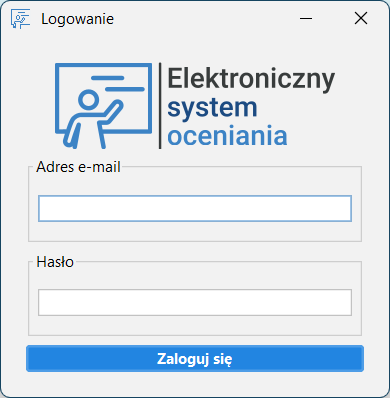
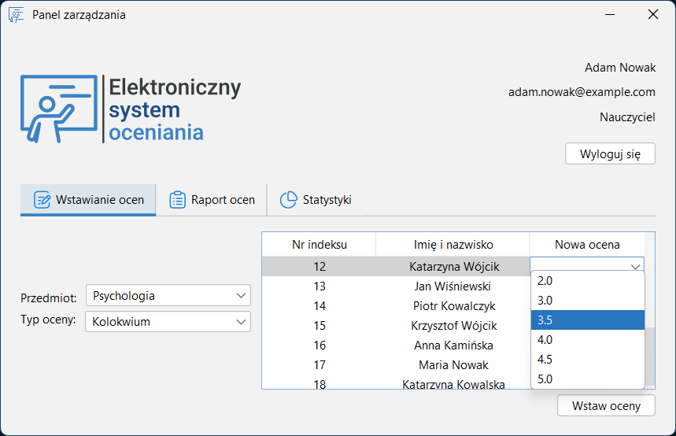
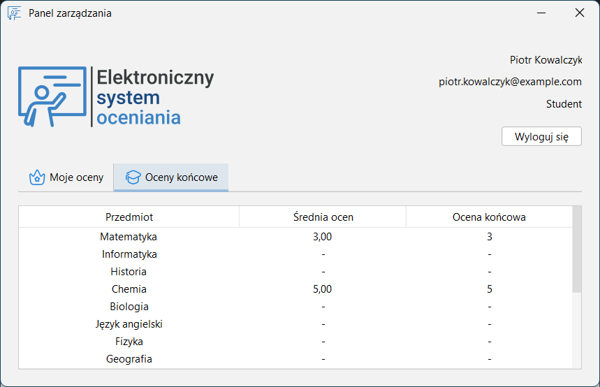

# Elektroniczny System Oceniania


Projekt zaliczeniowy laboratorium przedmiotu **"Programowanie obiektowe"**.

## Opis projektu
Elektroniczny System Oceniania to aplikacja desktopowa ułatwiająca nauczycielom zarządzanie ocenami studentów. Umożliwia dodawanie, edytowanie i przeglądanie wyników oraz generowanie raportów i statystyk. Studenci mogą przeglądać swoje oceny w intuicyjnym interfejsie.

Pełna dokumentacja projektu znajduje się w pliku `125145.docx`.

## Technologie i biblioteki
- **Język:** Java  
- **Biblioteki UI:** Swing, FlatLaf  
- **Baza danych:** MySQL (JDBC)  

## Struktura katalogu `src/`
Projekt składa się z kilku plików:

- **`Main.java`** – Klasa główna uruchamiająca aplikację, inicjalizująca połączenie z bazą danych i wyświetlająca ekran logowania.  
- **`LoginForm.java`** – Okno logowania użytkownika, umożliwiające uwierzytelnienie i przejście do głównego panelu zarządzania.  
- **`DashboardForm.java`** – Główne okno aplikacji, zawierające różne zakładki w zależności od roli użytkownika (student/nauczyciel).  
- **`Database.java`** – Klasa odpowiedzialna za połączenie z bazą danych MySQL.  
- **`User.java`** – Klasa reprezentująca użytkownika systemu, przechowująca jego dane i rolę.  
- **`Role.java`** – Enum definiujący role użytkowników (STUDENT, TEACHER).  
- **`Utilities.java`** – Zbiór metod pomocniczych, m.in. do walidacji danych, ustawiania ikon czy formatowania tabel.  

## Struktura bazy danych
Plik `eso.sql` zawiera pełną strukturę bazy danych wymaganą do działania systemu.  
Przed rozpoczęciem pracy należy zaimportować go do systemu zarządzania bazą danych.  

## Konfiguracja bazy danych
Przed uruchomieniem aplikacji należy skonfigurować dane dostępowe do bazy danych w pliku `Database.java`, edytując wartości zmiennych:

```java
private static final String DB_URL = "jdbc:mysql://localhost/eso";
private static final String DB_USER = "admin";
private static final String DB_PASSWORD = "admin";
```

Wartości `DB_URL`, `DB_USER` i `DB_PASSWORD` należy dostosować do konfiguracji lokalnej bazy danych.

## Instalacja i uruchomienie
1. Pobierz repozytorium.  
2. Zaimportuj plik `eso.sql` do MySQL.  
3. Skonfiguruj dane dostępowe w `Database.java`.  
4. Skompiluj projekt w IntelliJ IDEA lub innym środowisku obsługującym JDK 21.  
5. Uruchom `Main.java`.  

## Przykładowe zrzuty ekranu

### Okno logowania


### Panel nauczyciela – dodawanie ocen


### Statystyki ocen

